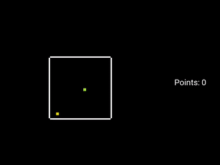
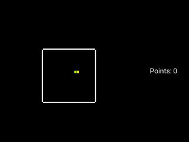

# Snake DQL

## Description

Deep Q-Learning on Snake game, implemented with PyTorch Lightning and Kivy visualization.

## Design

The results shown below were created with a model consisting of 2 hidden layers, both with 256 nodes, 11 input nodes, and 3 output nodes.

As an input binary vector was used, including 4 values for current snake movement direction, 4 values for food orientation based on snakes head, and 3 values for immediate danger around snakes head.

The output corresponds to 3 actions: turn left, go straight, turn right.

## Results

Untrained model:

After 2.5 min of training (10 000 iterations):

